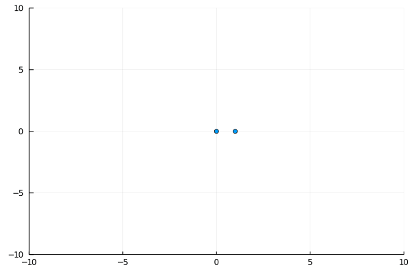
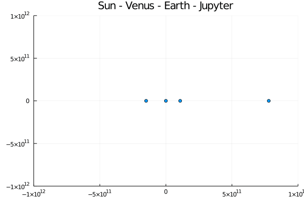

# Check out the videos in order

1. [Part 1 - Physical Introduction](./videos/class1/1_compressed.mp4)
2. [Part 2 - Coding it](./videos/class1/2_compressed.mp4)
3. [Part 3 - Visualisation](./videos/class1/3_compressed.mp4)
4. [Part 4 - Discussion](./videos/class1/4_compressed.mp4)

## Discussion topics

These were the side discussions discussed in Part 4.

1. Pluto - Cell dependency
2. Cyclic dependency
3. Pluto vs Jupyter
4. Optimizations
   1. Algorithmic - Barnes-Hut Optimization
   2. Implementation -
      1. Static Typing
      2. `force` calculation only once for each pair. Create an upper triangular matrix
      3. In-place updating `force` with .+= instead of =
      4. Preallocating `trajectory` and `forces` in `simulate`
   3. Hardware - GPU
5. Solving differential equations
   1. Euler
   2. Leap-frog
   3. Range-Kutta
6. Machine Learning solution to the N-Body problem - [Associated Arxiv paper](https://arxiv.org/abs/1910.07291)

# Completed Pluto Notebook

[nb1.jl](nb1.jl)

# Results

Some animation. I forgot what the parameters were :P

## Solar system

As mentioned in the video, I've taken planetary data from [NASA](https://nssdc.gsfc.nasa.gov/planetary/factsheet/) and I've run an animation for 12 earth years (1 Jupyter year), with a time step of 1 day. `dt` of one week is too inaccurate

It ran in a pretty short time, so I suppose you could add the rest of the planets too, but I don't suppose it will change much.

I've plotted at the 10th time step (10 days) and created a gif at 30fps. So every second is about 10 months

# What next?

- Try to implement this in Python and see the speed difference. Use numpy and then compare.
- Try to optimize my code as I've mentioned in the Implementation Optimizations in the [Discussion Topics](#discussion-topics). Use the [julia docs](https://docs.julialang.org/en/v1/) to the fullest. Using [BenchmarkTools](https://github.com/JuliaCI/BenchmarkTools.jl#quick-start) to profile your code!
- Implement a 3d version of the code. You'll see how easy it is to change it. Only `force` needs to be initialized as a 3 vector, and plot the z component too, as `scatter(xs, ys, zs, ...)`. Try the same in Python. Note that gr doesn't give you a nice rotatable 3d plot. You can either use the `camera` argument in the `scatter(...)` or, what I prefer, is to use the Plotly or PlotlyJS backends. More info can be found in the [Plots.jl docs](http://docs.juliaplots.org/latest/backends/). **_FIRST PLOTS TAKE TIME_**. Use [planetary data from NASA](https://nssdc.gsfc.nasa.gov/planetary/factsheet/) and also use the `Orbital Inclination` parameter in the dataset to set your initial conditions. If possible, use data for planets on some day, instead of the averages.
- Implement the [Barnes-Hut Optimization](https://en.wikipedia.org/wiki/Barnes–Hut_simulation#Algorithm). Don't cheat.
- Collisions? Either simulate it using a central force which falls very quickly (see Patta's notes for more detail), or make them "stick" together(How?). This will need you to add a radius to the planet.
- Perturb the system? Launch a small asteroid. See Jupiter's screening effect in play.
- Add the Moon! You may need to zoom in by setting the `xlims` and `ylims` to see the moon separately from the earth.
- Set up 2 solar systems (Just use 4/5 planets) some distance from each other, such that there is a binary star system. You may need to give some initial velocity to the suns. Is a "stable" orbit possible? Simulate for long time scales.
- Should we use a variable `dt`? When objects are very close, they tend to accelerate quickly. Using smaller `dt` for this is better, while we can use larger `dt` for smaller forces. How will you calculate this `dt`? Try some guess functions. Make sure to use the same `dt` for each planet, otherwise they'll end being in different times!
